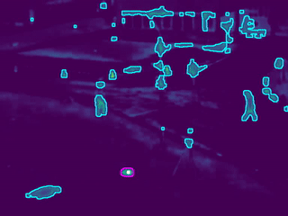
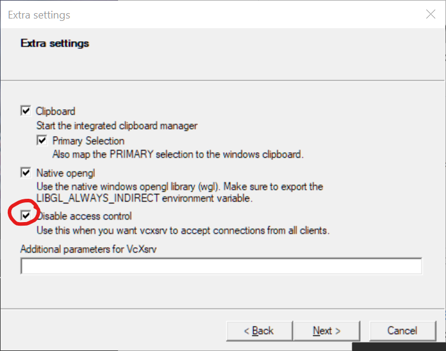

# Bottom-up Saliency Model

## Description

Detect visual saliency from video or images.




*NOTES*:

- Need to implement inhibition of return for output saliency map
- USB camera option available but currently getting slow FPS.

## Program Usage

Running `./saliency --help` will show the following output:

```
Usage: saliency [params]

        -?, -h, --help
                print this help message
        --alt_exit
                sets program to allow right-clicking on the "Saliency" window to exit
        --cam
                usb camera index as input, use 0 for default device
        --debug
                toggle visualization of feature parameters. --dir output will be disabled
        --dir
                full path to where the saliency output directory will be created
        --img
                full path to image file as input
        --no_gui
                turn off displaying any output windows and using OpenCV GUI functionality. Will ignore --debug
        --par
                full path to the YAML parameters file
        --split
                output will be saved as a series of images instead of video
        --start_frame
                start detection at this value instead of starting at the first frame, default=1
        --stop_frame
                stop detection at this value instead of ending at the last frame, default=-1 (end)
        --vid
                full path to video file as input
```

Assuming you are in the directory containing the `saliency` executable program..., e.g., `VideoSalientCpp/saliency/bin`.

### Using video as input

Point to the sample video named `vtest.avi`, use the parameters settings from `parameters.yml`, and export data to the `exported` folder.

```bash
saliency --vid=../share/samples/vtest.avi --par=../share/parameters.yml --dir=../share/exported
```

### Using an image as input

Export will be a video if `--dir` is specified, even though input is an image. The video will be the number of frames before closing the window, unless `--stop_frame` is specified.

```bash
saliency --img=../share/samples/racoon.jpg --dir=../share/exported
```

Instead of a video as the output, frames will be split into images with `--split`.

```bash
saliency --img=../share/samples/racoon.jpg --dir=../share/exported --split
```

If you want to use a series of images as input, images must be in the same folder and numbered (see `samples/tennis` as an example). You also must specify this as a video using `--vid`, and enter the numbering format as seen below.

```bash
saliency --vid=../share/samples/tennis/%05d.jpg
```


### Using a USB camera device as input

Use the default camera device.

```bash
saliency --cam=0
```

### Using custom saliency model parameters

Specify different saliency parameters  using the `--par` option. If not specified, uses the internal default parameters. Parameters that can be edited are:

```yaml
# General saliency model parameters
model:
   # Max LoG kernel window size. Set to -1 to use ~min(rows, cols)/4
   max_LoG_prop: -1
   n_LoG_kern: -1
   gauss_blur_win: -1
   contrast_factor: 4.
   central_focus_prop: 6.7000000000000004e-01
   saliency_thresh: -1.
   saliency_thresh_mult: 2.
# List of feature channel parameters
feature_channels:
   # Luminance/Color parameters
   color:
      colorspace: LAB
      rescale: 6.
      filter: 5.0000000000000000e-01
      weight: 1.
   # Line orientation parameters
   lines:
      # Kernel size for square gabor patches. Set to -1 to use ~min(rows, cols) * .02
      gabor_win_size: -1
      n_rotations: 8
      sigma: 3.5000000000000000e+00
      lambda: 10.
      psi: 1.9635000000000000e+00
      gamma: 6.2500000000000000e-01
      weight: 1.
   # Motion flicker parameters
   flicker:
      lower_limit: 32.
      upper_limit: 255.
      weight: 1.
   # Optical flow parameters
   flow:
      # Size of square flow estimation window. Set to -1 to use ~min(rows, cols) * .125
      flow_window_size: -1
      max_num_points: 150
      min_point_dist: 8.
      morph_half_win: 3
      morph_iters: 8
      weight: 1.
```

## Building from source

Download repository contents to your user folder (you can download anywhere but the example below uses the user folder). If you already have git installed, you can do the following in a terminal.

```bash
cd ~
git clone https://github.com/iamamutt/VideoSalientCpp.git
```

Anytime there are updates to the source code, you can navigate to the `VideoSalientCpp` folder and pull the new changes with:

```bash
cd ~/VideoSalientCpp
git pull
```

### OSX

You will need some developer tools to build the program, open up the terminal app and run the following:

```bash
xcode-select --install
```

If you type `clang --version` in the terminal, you should see the output below. The version should be at least 11.

```bash
Apple clang version 11.0.0 (clang-1100.0.33.16)
Target: x86_64-apple-darwin19.6.0
Thread model: posix
```

You'll also need Homebrew to grab the rest of the libraries and dependencies: https://brew.sh/

After Homebrew is installed, run:

```bash
brew update
brew install cmake opencv ffmpeg
```

After the above dependencies are installed, navigate to the repository folder, e.g., if you saved the contents to `~/VideoSalientCpp` then run `cd ~/VideoSalientCpp`. Once in the folder root, run the following to build the `saliency` binary.

```bash
mkdir build && cd build
cmake -DCMAKE_BUILD_TYPE=Release ..
cmake --build . --config Release --target install
cd ..
```

The compiled binaries will be in `./saliency/bin`. Test using the samples data:

```bash
cd saliency
./bin/saliency --vid=share/samples/vtest.avi
```

Hold the "ESC" key down to quit (make sure the saliency output window is selected).


### Windows

Install dependencies:

- OpenCV (>=4.5.0) https://github.com/opencv/opencv/archive/4.5.0.zip
- CMake Binary distribution https://cmake.org/download/
- GCC (>= 10) http://winlibs.com/

#### OpenCV Source Build instructions

_TODO_

Once OpenCV is built from source, build the saliency program by navigating to the repo. You'll need to know the path where `OpenCVConfig.cmake` is located. Substitute `<OpenCVDir>` with that path below.

```
cd path/to/VideoSalientCpp
mkdir build && cd build
cmake --no-warn-unused-cli -DOPENCV_INSTALL_DIR=<OpenCVDir> -DCMAKE_BUILD_TYPE=Release -G "MinGW Makefiles" ..
cmake --build . --config Release --target install -- -j
```

The saliency program will be in `VideoSalientCpp/saliency/bin`.


## Using the Docker image

If you don't want to build from source you can use the docker image to run the program. The image can be found in [Releases](https://github.com/iamamutt/VideoSalientCpp/releases).

### Setup

1. Install Docker Desktop: https://www.docker.com/get-started
2. Open the application after install. Allow privileged access if prompted. 
3. Check that Docker works from the command line. From a terminal type: `docker --version`.
4. Obtain the docker image `saliency-image.tar.gz` from "releases" on GitHub.
5. In a terminal, navigate to the directory containing the docker image and load it with `docker load -i saliency-image.tar.gz`
6. Run the image by entering the command `docker run -it --rm saliency-app:latest`. You should see the saliency program help documentation.

### Configure

#### Editing `docker-compose.yml`

Open up the file `docker-compose.yml` in any text editor. The fields that need to be changed are `environment`, `command`, and `source`.

- `source`: The keys `volumes: source:` maps a directory on your host machine to a directory inside the docker container. E.g., `source: /path/to/my/data`. If your data is located on your computer at `~/videos`, then use the full absolute path such as `source: $USERPROFILE/videos` on windows or `source: $HOME/videos` for unix-based systems. To use the samples from this repo, set the source mount as: `source: <saliency>/saliency/share`, where `<saliency>` is the full path to the `VideoSalientCpp` repo folder.

- `command`: These are the command-line arguments passed to the saliency program. If you want to specify a video to use with the `--vid=` option then use the relative path from the mapped volume. E.g., `--vid=my_video.avi` which may be located in `~/videos`. Add the option `--no_gui` to run the container without installing XQuartz or XLaunch on your host machine.

- `environment`: Change `DISPLAY=#.#.#.#:0.0` to whatever your IP address is. If your IP address is `192.168.0.101` then the field would be `- DISPLAY=192.168.0.101:0.0`. This setting is required for displaying output windows. If you would like to run the program without displaying any output, set the option `--no_gui` in the `command: ` list. See the `Displaying windows` section below for GUI setup.

#### Running `docker-compose.yml`

After configuring `docker-compose.yml`, run the `saliency` service by entering this in the terminal:

```bash
docker-compose run --rm saliency
```

#### Displaying windows

When running from the docker container, the saliency program tries to show windows of the saliency output. These windows are generated by OpenCV and require access to the display. This access is operating system dependent, and without some way to map the display from the container to your own host machine you will generate an error such as `Can't initialize GTK backend in function 'cvInitSystem'`. 

After performing the steps below, you should now be able to run `docker-compose` without the `--no-gui` option and be able to see the output windows. You'll need to have XLaunch or XQuartz running each time you try to run the docker container.

##### Windows

1. Download and install VcXsrv from here: https://sourceforge.net/projects/vcxsrv/
2. Run XLaunch and use all the default settings except for the last where it says "Disable access control." Make sure its selected.



To get your IP address on Windows: 

```
ipconfig
```

Look for the line IPv4 Address and edit the `docker-compose.yml` file with your address.

##### OSX

Use Homebrew to install XQuartz and open the application.

```bash
brew install xquartz
open -a Xquartz
```

Once XQuartz is open, allow connections by going to:

_XQuartz > preferences > Security > allow connections from network clients_

Next you will need your IP address. Get it with the command below.

```bash
ifconfig en0
```

Look at the `inet` line from the `ifconfig` output. If your IP address is `192.168.0.101` then set you'll set the environment variable `DISPLAY` to this address using the docker `-e` option. To test if everything works, run the command below. 

This command opens up XQuartz and allows a connection between docker and the X server. It then runs the docker image using a video sample stored in the image.

```bash
xhost +
docker run -e DISPLAY=192.168.0.101:0.0 saliency-app:latest -c --vid=../internal/samples/vtest.avi
```

Edit the `docker-compose.yml` file with your IP address. You will have to run `docker-compose` with the `xhost` command each time.

```bash
xhost + && docker-compose run --rm saliency
```

Quit XQuartz when you're done.

<!--
# cd opencv && docker build . -t opencv-build:v1.0.0
# docker run --rm -it opencv-build:v1.0.0

# docker build . --target saliency_build -t tmp-build:0.0.1
# docker run -it --rm tmp-build:0.0.1

# docker build . -t saliency-app:latest
# docker run -it --rm --entrypoint /bin/bash saliency-app:latest
# docker run -e DISPLAY=10.0.0.34:0.0 -it --rm saliency-app:latest
# docker run --device=/dev/video0:/dev/video0 -v /tmp/.X11-unix:/tmp/.X11-unix -e DISPLAY=$DISPLAY -p 5000:5000 -p 8888:8888 -it --rm saliency-app:latest

docker run -e DISPLAY=10.0.0.134:0 saliency-app:latest -c --vid=../internal/samples/vtest.avi
-->
